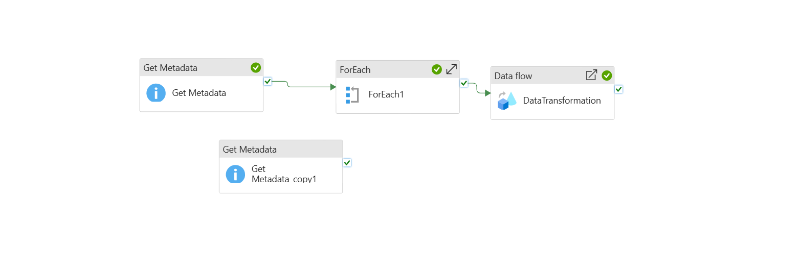
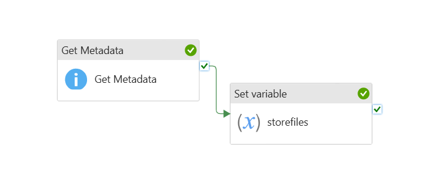
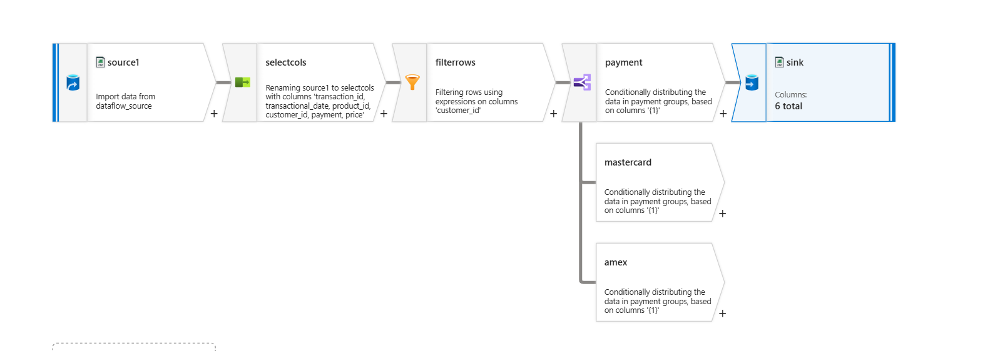

# Azure Retail Lakehouse (ADLS Gen2 + Synapse Serverless + ADF)

This repo demonstrates a mini **lakehouse** on Azure using one retail CSV dataset.

- **WIN 1:** Query raw CSV in ADLS Gen2 using **Synapse Serverless OPENROWSET**  
- **WIN 2:** Create **Gold** Parquet external tables using **CETAS** (dim_date, dim_customer, dim_product, fact_sales)  
- **WIN 3:** Showcase **Azure Data Factory** orchestration (Get Metadata → If Condition → ForEach → Mapping Data Flow → Set Variable → Storage Events Trigger)

---

## Architecture (Medallion)

# Azure Retail Lakehouse Project

This project demonstrates a mini **Azure Lakehouse** built on ADLS Gen2, Synapse Serverless SQL, and Azure Data Factory.  
Dataset: `retail_sales_dataset.csv` (retail transactions).

---

## WIN 1 – Bronze (Query Raw Data with Synapse)

- Connected Synapse Serverless to ADLS Gen2 using **Managed Identity**.  
- Queried the raw CSV file directly with **OPENROWSET**.  

📄 Script: [`Azure Synapse Script 1.sql`](Azure%20Synapse%20Script%201.sql):contentReference[oaicite:5]{index=5}  

**What this shows:** You can explore data directly from Data Lake without loading it into a table.

---

## WIN 2 – Gold (Curated Tables with CETAS)

- Created four curated **Parquet external tables** using **CETAS**:  
  - `dim_date`, `dim_customer`, `dim_product`, `fact_sales`  
- Represent a simple **star schema** for reporting and BI.

📄 Script: [`Azure Synapse Script 2.sql`](Azure%20Synapse%20Script%202.sql):contentReference[oaicite:6]{index=6}

**What this shows:** How to transform CSV data into structured Parquet, ready for analytics.

---

## WIN 3 – Orchestration with Azure Data Factory (ADF)

Built an ADF pipeline to showcase common orchestration and transformation activities:

1. **Get Metadata** – list files in the Bronze container:contentReference[oaicite:7]{index=7}  
2. **If Condition** – checks whether file names match a rule (example: starts with `Fact`):contentReference[oaicite:8]{index=8}  
3. **ForEach** – loops through files returned by Get Metadata:contentReference[oaicite:9]{index=9}  
4. **Mapping Data Flow** – performs transformations:  
   - **Select** → choose needed columns  
   - **Filter** → remove rows (example: customer_id ≠ 12):contentReference[oaicite:10]{index=10}  
   - **Conditional Split** → branch rows by payment type (Visa, Mastercard, Amex):contentReference[oaicite:11]{index=11}  
   - **Sink** → write cleaned output back to Data Lake  
5. **Set Variable** – stores output info for debugging/logging:contentReference[oaicite:12]{index=12}  
6. **Storage Event Trigger** – automatically fires pipeline when a new file lands in Bronze  

📄 Pipeline JSON: [`pipelines.json`](pipelines.json)  
📄 Data Flow JSON: [`Transform.json`](Transform.json)  
📄 Variable Pipeline JSON: [`set-variable.json`](set-variable.json)

🖼️ Screenshots:  
- Full pipeline:   
- Set Variable activity:   
- Data Flow transformations: 

**What this shows:** Control flow (Get Metadata, If, ForEach, Set Variable), data flow transformations, and event-driven orchestration in ADF.

---

## Outputs

- **Bronze**: raw CSV in ADLS Gen2.  
- **Gold**: curated Parquet star schema tables in Synapse.  
- **ADF Pipeline**: automated data transformations with orchestration and triggers.

---

## High-Level Steps to Reproduce

1. Create ADLS Gen2 storage, container `bronze`, and upload `retail_sales_dataset.csv`.  
2. Grant Synapse workspace **Storage Blob Data Contributor** role.  
3. Run `Azure Synapse Script 1.sql` to query Bronze.  
4. Run `Azure Synapse Script 2.sql` to generate Gold Parquet tables.  
5. Import ADF JSONs to view the pipeline and data flow design.  

---

## Notes

- Scripts use **OPENROWSET** and **CETAS** with Managed Identity for security.  
- ADF pipeline demonstrates **branching, looping, transformations, and triggers**.  
- This repo is for learning/demo; pipelines don’t need to be executed.

